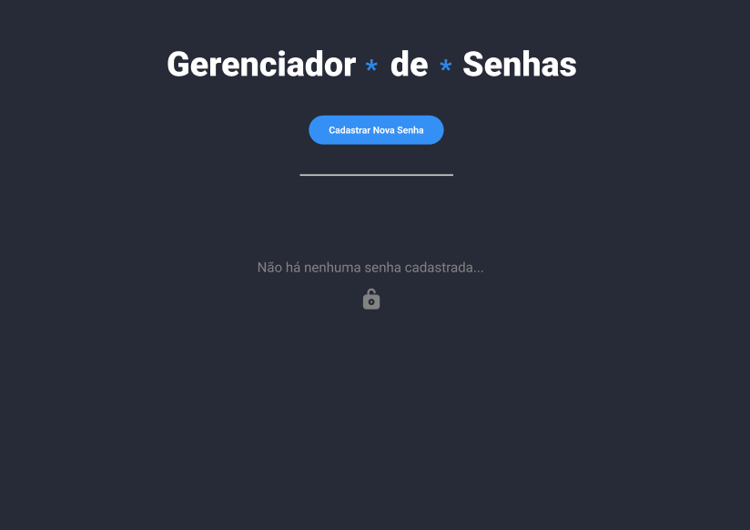
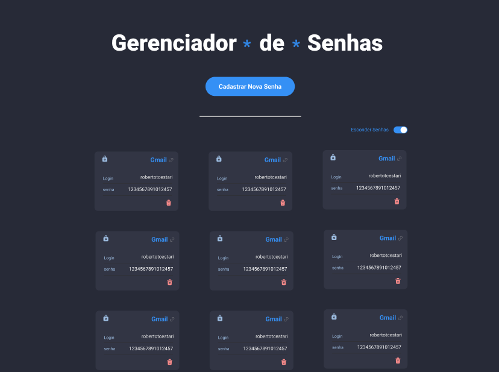

<h1><strong>Password Manager</strong></h1> 

<h2><strong>Descrição</strong></h2> 

 
  Este projeto consiste no desenvolvimento de um gerenciador de senhas, no qual as pessoas usuárias podem cadastrar, visualizar e gerenciar senhas de serviços utilizados na internet, como e-mails, redes sociais e plataformas financeiras. O foco está na organização dos dados e na experiência de uso ao listar, ocultar e remover credenciais de forma simples. 

 

<h2><strong>Funcionalidades</strong></h2> 
<ul> 
  <li align="justify">Cadastrar senhas para serviços online, como e-mails, redes sociais, serviços bancários e outros.</li> 
  <li align="justify">Visualizar as senhas cadastradas juntamente com as informações dos serviços correspondentes.</li> 
  <li align="justify">Ocultar e exibir as senhas salvas para garantir maior segurança das informações.</li> 
  <li align="justify">Remover senhas e dados de serviços que não precisam mais ser armazenados.</li> 
</ul> 

<h2><strong>Demonstração do Projeto</strong></h2> 
  
 
   
   
    
  <a href="https://williandpg.github.io/password-manager/" target="_blank"><strong>Acesse a demonstração</strong></a> 

 

<h2><strong>Tecnologias Utilizadas</strong></h2> 
<ul> 
  <li align="justify"> <a href="https://developer.mozilla.org/pt-BR/docs/Web/HTML" target="_blank"><strong>HTML</strong></a>. Utilizado para estruturar e organizar o conteúdo da aplicação. </li> 
  <li align="justify"> <a href="https://developer.mozilla.org/pt-BR/docs/Web/CSS" target="_blank"><strong>CSS</strong></a>. Utilizado para estilizar os elementos, definir layout e responsividade da interface. </li> 
  <li align="justify"> <a href="https://react.dev/" target="_blank"><strong>React</strong></a>. Utilizado para construir a interface de forma declarativa, componentizada e reaproveitável. </li> 
  <li align="justify"> <a href="https://www.typescriptlang.org/" target="_blank"><strong>TypeScript</strong></a>. Utilizado para adicionar tipagem estática ao JavaScript, tornando o desenvolvimento mais seguro e produtivo. </li> 
  <li align="justify"> <a href="https://git-scm.com/" target="_blank"><strong>Git</strong></a> e <a href="https://github.com/" target="_blank"><strong>GitHub</strong></a>. Utilizados para controle de versão, histórico de alterações e colaboração no código fonte. </li> 
  <li align="justify"> <a href="https://vitejs.dev/" target="_blank"><strong>Vite</strong></a>. Utilizado como bundler e ferramenta de desenvolvimento para projetos React com TypeScript. </li> 
</ul> 

<h2><strong>Estrutura do Projeto</strong></h2> 

A estrutura do projeto é organizada da seguinte forma.
 

<pre><code>
/ 
├── public/ 
│ ├── favicon.ico 
│ └── password-manager-preview.png 
├── src/ 
│ ├── components/     # Componentes reutilizáveis da interface
│ ├── images/        # Imagens e ícones utilizados no projeto
│ ├── tests/          # Testes unitários e de integração
│ ├── App.css
│ ├── index.css
│ ├── App.tsx 
│ └── main.tsx 
├── index.html 
├── package.json 
├── tsconfig.json 
├── vite.config.ts 
└── README.md 
</code></pre> 

<h2><strong>Contato</strong></h2> 

 
  <strong>Willian Gonçalves</strong> |
  <a href="https://www.linkedin.com/in/williandpg/" target="_blank"><strong>LinkedIn</strong></a> |
  <a href="https://github.com/williandpg" target="_blank"><strong>GitHub</strong></a> |
  <a href="https://williandpg.github.io/" target="_blank"><strong>Portfólio</strong></a> |
  <a href="mailto:goncalves.wdp@outlook.com" target="_blank"><strong>Email</strong></a>

 

<h2><strong>Créditos</strong></h2> 

 
  Este projeto foi desenvolvido como parte da formação em Desenvolvimento Web Full Stack na Trybe.

 

 
  
<strong>English Version</strong>
 
  
  <h1><strong>Password Manager</strong></h1> 
  
  <h2><strong>Description</strong></h2> 

  
 
    This project is a password manager that allows users to register, view and manage passwords for online services such as email accounts, social networks and financial platforms. The main goal is to organize credentials and provide a simple experience to list, hide and remove stored passwords. 
  
 
  
  <h2><strong>Features</strong></h2> 
  <ul> 
  <li align="justify">Register passwords for online services such as email accounts, social networks, banking apps and others.</li> 
  <li align="justify">Display all registered passwords along with their service information.</li> 
  <li align="justify">Hide and show stored passwords to increase information security.</li> 
  <li align="justify">Remove passwords and related service data that are no longer needed.</li> 
  </ul> 
  
  <h2><strong>Project Demonstration</strong></h2> 
  
 
   
  
    
  <a href="https://williandpg.github.io/password-manager/" target="_blank"><strong>Access the demonstration</strong></a>
  
 
  
<h2><strong>Technologies Used</strong></h2> 
<ul> 
<li align="justify"> <a href="https://developer.mozilla.org/docs/Web/HTML" target="_blank"><strong>HTML</strong></a>. Used to structure and organize the application content. </li> 
<li align="justify"> <a href="https://developer.mozilla.org/docs/Web/CSS" target="_blank"><strong>CSS</strong></a>. Used to style the elements and define the layout and responsiveness. </li> 
<li align="justify"> <a href="https://react.dev/" target="_blank"><strong>React</strong></a>. Used to build the user interface in a declarative and component based way. </li> 
<li align="justify"> <a href="https://www.typescriptlang.org/" target="_blank"><strong>TypeScript</strong></a>. Used to add static typing to JavaScript, making development safer and more productive. </li> 
<li align="justify"> <a href="https://git-scm.com/" target="_blank"><strong>Git</strong></a> and <a href="https://github.com/" target="_blank"><strong>GitHub</strong></a>. Used for source code version control, history and collaboration. </li> 
<li align="justify"> <a href="https://vitejs.dev/" target="_blank"><strong>Vite</strong></a>. Used as the bundler and development tool for the React and TypeScript project. </li> 
</ul> 

<h2><strong>Project Structure</strong></h2> 

The project structure is organized as follows.
 
<pre><code>
/ 
├── public/ 
│ ├── favicon.ico 
│ └── password-manager-preview.png 
├── src/ 
│ ├── components/     # Reusable interface components
│ ├── images/         # Images and icons used in the project
│ ├── tests/          # Unit and integration tests
│ ├── App.css
│ ├── index.css
│ ├── App.tsx 
│ └── main.tsx 
├── index.html 
├── package.json 
├── tsconfig.json 
├── vite.config.ts 
└── README.md 
</code></pre> 

<h2><strong>Contact</strong></h2> 

 
  <strong>Willian Gonçalves</strong> |
  <a href="https://www.linkedin.com/in/williandpg/" target="_blank"><strong>LinkedIn</strong></a> |
  <a href="https://github.com/williandpg" target="_blank"><strong>GitHub</strong></a> |
  <a href="https://williandpg.github.io/" target="_blank"><strong>Portfolio</strong></a> |
  <a href="mailto:goncalves.wdp@outlook.com" target="_blank"><strong>Email</strong></a> 

 
    
<h2><strong>Credits</strong></h2> 

 
  This project was developed as part of the Full Stack Web Development training at Trybe.

 

